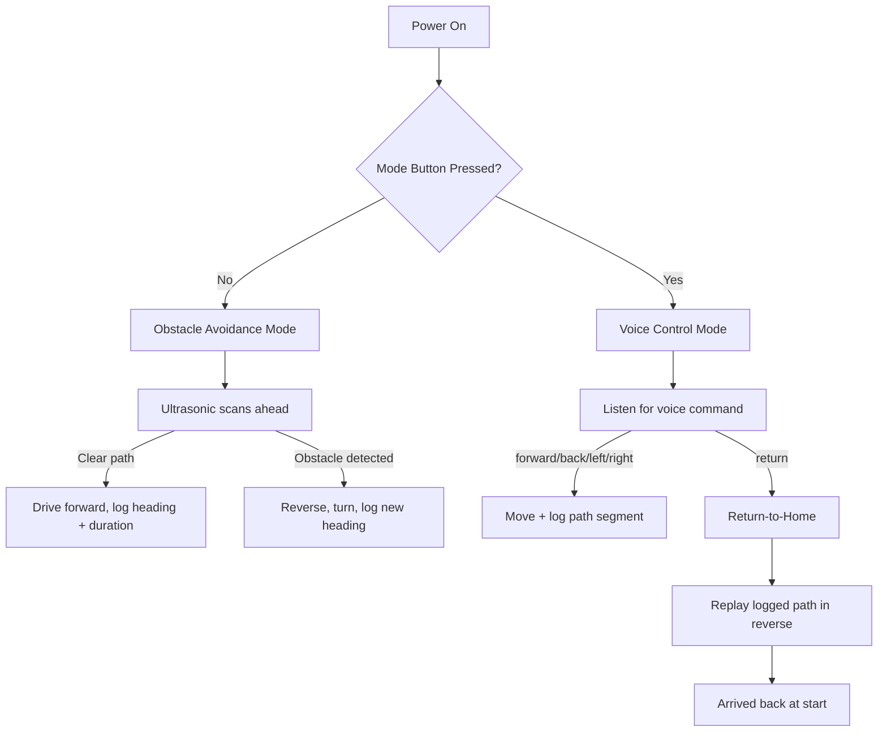

# 🤖 Dual-Mode Autonomous Navigation Robot

-00979D)

A robot that thinks on its feet **and** listens — switch between autonomous obstacle avoidance and offline voice control with a single button press, and call it home with your voice.

> 🗓️ **Timeline:** Nov 2025 – Jan 2026 (initial build) · Mar 2026 – May 2026 (voice + Return-to-Home extension)

---

## 📑 Table of Contents

- [Overview](#-overview)
- [Features](#-features)
- [Hardware Used](#-hardware-used)
- [Pin Mapping](#-pin-mapping)
- [How It Works](#-how-it-works)
- [Software Setup](#-software-setup)
- [PCB Design](#-pcb-design)
- [Future Improvements](#-future-improvements)
- [Author](#-author)

---

## 🧭 Overview

This robot runs on an **ESP32** and a custom PCB (designed in **EasyEDA**) that ties together the sensor interfaces, motor driver, and voice module on one board. It has three tricks up its sleeve:

| Capability | What it does |
|---|---|
| 🚧 **Obstacle Avoidance** | Wanders autonomously, reversing and turning away from anything in its path |
| 🎙️ **Offline Voice Control** | Understands spoken commands locally — no Wi-Fi, no cloud, no latency |
| 🏠 **Return-to-Home** | Remembers the path it took and can retrace it back to the start on command |

---

## ✨ Features

- 🔀 One-button toggle between Obstacle Avoidance and Voice Control modes
- 🗣️ Six voice commands recognized **entirely on-device**: forward, back, left, right, stop, return
- 🧵 Lightweight dead-reckoning odometry that logs every move (heading + duration)
- 🔁 Return-to-Home replays the logged path in reverse to navigate back
- 🛠️ Custom PCB integrating motor driver, sensors, and voice module headers

---

## 🔧 Hardware Used

| Component | Purpose |
|---|---|
| ESP32 Dev Module | Main controller — dual-core handles sensing, driving, and voice in parallel |
| L298N motor driver | Drives two DC gear motors |
| HC-SR04 ultrasonic sensor | Front-facing obstacle detection |
| Elechouse Voice Recognition V3 module | Offline, locally-trained voice command recognition (UART) |
| Push button | Toggles between the two modes |
| Custom PCB (EasyEDA) | Integrates motor driver, sensor headers, and power distribution |

---

## 🔌 Pin Mapping

| Function | ESP32 Pin |
|---|---|
| Motor A — Enable / IN1 / IN2 | GPIO25 / GPIO26 / GPIO27 |
| Motor B — Enable / IN3 / IN4 | GPIO33 / GPIO14 / GPIO12 |
| Ultrasonic — TRIG / ECHO | GPIO5 / GPIO18 |
| Mode select button | GPIO4 |
| Voice module — RX / TX (UART2) | GPIO16 / GPIO17 |

---

## ⚙️ How It Works

**Obstacle Avoidance** — drives forward while polling the ultrasonic sensor; if something's within ~25 cm, it reverses, turns, and carries on.

**Voice Control** — commands are recognized **on the VR module itself** (trained offline), which sends a command ID to the ESP32 over UART.

**Return-to-Home** — every motion segment's heading and duration gets logged. On the "return" command, the robot walks back through the log in reverse order, turning to the opposite heading of each step and driving for the same duration.

> 💡 This is a lightweight, timing-based dead-reckoning approach. For tighter accuracy, swap in wheel-encoder tick counts and/or an IMU (e.g. MPU6050) for heading correction.

---

## 💻 Software Setup

1. Install the **ESP32 board package** in Arduino IDE (`esp32` by Espressif Systems, via Boards Manager).
2. No external libraries needed beyond the built-in `HardwareSerial`.
3. Train your **Elechouse VR3** module's six commands (forward, back, left, right, stop, return), mapped to IDs `0–5` as used in `src/main.ino`.
4. Upload `src/main.ino` to the ESP32.
5. Power the motor driver from a **separate battery pack** — don't run motors off the ESP32's onboard 3.3V/5V rail.

---

## 🖨️ PCB Design

Designed in **EasyEDA**, the board integrates headers for the motor driver, ultrasonic sensor, and voice recognition module, with routing planned to keep motor-switching noise away from sensitive sensor signal lines.

---

## 🚀 Future Improvements

- [ ] Encoder + IMU fusion for accurate Return-to-Home
- [ ] Servo-mounted ultrasonic sweep for lightweight mapping
- [ ] Expanded voice vocabulary + wake-word detection

---

## 👤 Author

**Mahi Raghuvanshi**
B.Tech, Electronics and Communication Engineering
